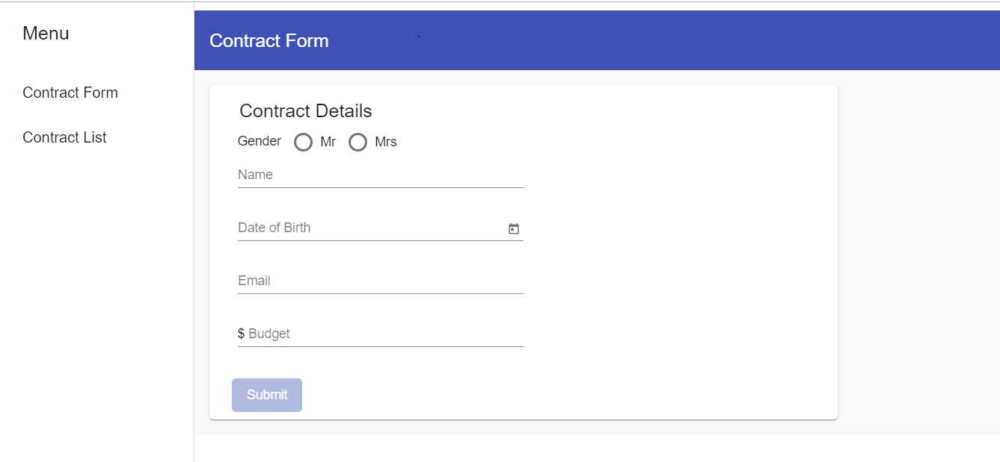
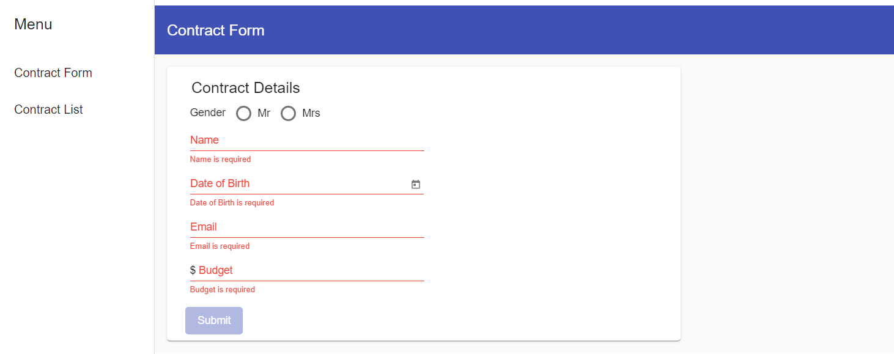
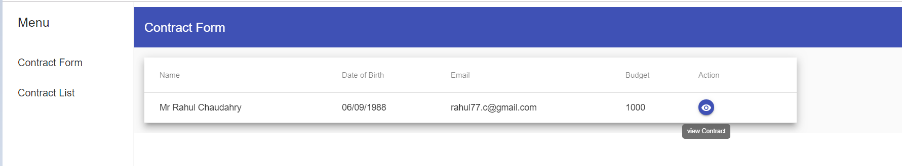
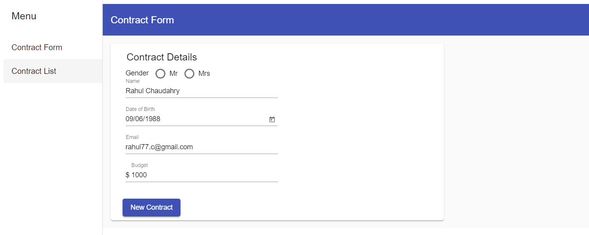
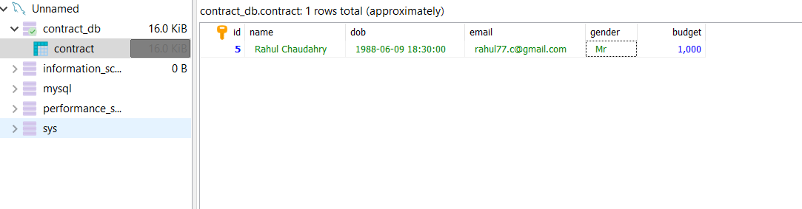

# Contract Form Poc

> This is a small PoC (Proof of Concept) to create and view the contact form.

## About

This project uses [Feathers](http://feathersjs.com) and [Angular](https://angular.io/). Both open source web framework for building modern real-time applications.

## Technology

* [Angular v8](https://angular.io/)
* [Angular Material v8](https://material.angular.io/)
* [Feathers v3](http://feathersjs.com)
* [feathers-sequelize v6](https://angular.io/)
* [mysql2](https://angular.io/)

## Getting Started

Getting up and running is as easy as 1, 2, 3.

1. Make sure you have [NodeJS](https://nodejs.org/) and [npm](https://www.npmjs.com/) installed.

2. Install your dependencies

    ```
    cd path/to/feathers-forms-angular; npm install
    ```

2. Install Font End your dependencies

     ```
    cd path/to/feathers-forms-angular/Front-end; npm install
    ```

2. Build Front End Angular application

     ```
    cd path/to/feathers-forms-angular/Front-end; npm build
    ```
    This will complipe the angular application anr put the content to path/to/feathers-forms-angular/public directory.

3. Start your app

    ```
    cd path/to/feathers-forms-angular; npm start
    ```

## Create Contract Form



### Form Validation



## View All Contracts



### View Contract



## MySql



## Testing

Simply run `npm test` and all your tests in the `test/` directory will be run.

## Help

For more information on all the things you can do with Feathers visit [docs.feathersjs.com](http://docs.feathersjs.com) and [angular.io](https://angular.io/).

## Changelog

__0.1.0__

- Initial release

## License

Copyright (c) 2018

Licensed under the [MIT license](LICENSE).
